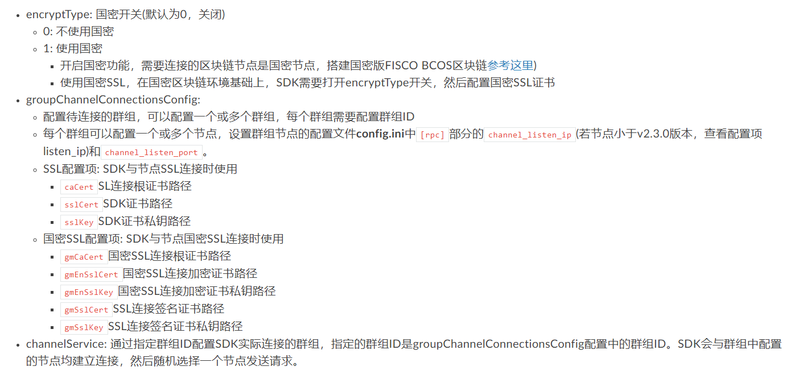
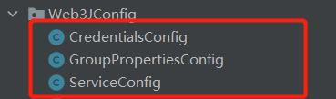

# springboot-fisco-bcos-demo
springboot+fisco-bcos的学习demo

# 项目使用 [Java sdk](https://fisco-bcos-documentation.readthedocs.io/zh_CN/release-2.7.0/docs/sdk/java_sdk/index.html) [Web3SDK]((https://fisco-bcos-documentation.readthedocs.io/zh_CN/release-2.7.0/docs/sdk/java_sdk.html#id13)) [fisco-bcos 2.7.2]((https://fisco-bcos-documentation.readthedocs.io/zh_CN/release-2.7.0/docs/installation.html))

## sdk实例化

### web3sdk 

#### 配置 

* 参考https://fisco-bcos-documentation.readthedocs.io/zh_CN/latest/docs/sdk/java_sdk.html#sdk 

* 

* ```properties
  #在application.properties中进行配置
  #是否使用国密用户
  encrypt-type=0
  
  #GroupChannelConnectionsConfig 配置待连接的群组，可以配置一个或多个群组，每个群组需要配置群组ID
  #GroupChannelConnectionsConfig配置 证书
  #1.把证书放在resource目录下的conf中
  #2.注意这里要添加classpath:
  group-channel-connections-config.caCert=classpath:conf/ca.crt
  group-channel-connections-config.sslCert=classpath:conf/sdk.crt
  group-channel-connections-config.sslKey=classpath:conf/sdk.key
  #节点所属的群组
  group-channel-connections-config.all-channel-connections[0].group-id=1
  #每个群组可以配置一个或多个节点，设置群组节点的配置文件config.ini中[rpc]部分的channel_listen_ip(若节点小于v2.3.0版本，查看配置项listen_ip)和channel_listen_port。
  group-channel-connections-config.all-channel-connections[0].connections-str[0]=192.168.13.135:20200
  group-channel-connections-config.all-channel-connections[0].connections-str[1]=192.168.13.135:20201
  
  # sdk实际连接的群组
  channel-service.group-id=1
  
  #指定操作智能合约的账号私钥
  #注意要提前创建好账号
  account-config.private-key=aeed0683be93b0d30cffcd5c2a6214eb9f3cf9ce5faa5f15bec44228c26c442a
  
  ```

  * 通过`@ConfigurationProperties(prefix = "xxx")`把配置绑定到指定java类
    * 
      * `CredentailsConfig` 用来绑定 `指定操作智能合约的账号私钥` 配置 并且生成一个用来操作sdk发送交易的外部账号类 `Credentials`
      * `GroupPropertiesConfig` 用来绑定 `GroupChannelConnectionsConfig配置`, 用来生成一个`groupChannelConnectionsConfig`类
      * `ServiceConfig`用来绑定 `channel-service.group-id`，用上面生成的`groupChannelConnectionsConfig` 类来生成一个`org.fisco.bcos.channel.client.Service`类
      * 然后通过@Bean 加载到springboot的容器中，方便通过@Autowired调用 
        
#### 实例化

*  `study.fisco.demo.sdkClient.Web3JClient`

  ```java
  ChannelEthereumService channelEthereumService = new ChannelEthereumService();
  service.run(); #org.fisco.bcos.channel.client.Service类
  channelEthereumService.setChannelService(service);
  logger.info("web3j实例化成功");
  //获取Web3j对象
  return Web3j.build(channelEthereumService, service.getGroupId());
  ```

  

  

###  javaSdk 

#### 配置

* 参考[配置说明 — FISCO BCOS v2.7.2 文档 (fisco-bcos-documentation.readthedocs.io)](https://fisco-bcos-documentation.readthedocs.io/zh_CN/release-2.7.0/docs/sdk/java_sdk/configuration.html)

* ```properties
  #在application.properties中进行配置
  ### JavaSdk configuration
  #证书配置
  #https://fisco-bcos-documentation.readthedocs.io/zh_CN/release-2.7.0/docs/sdk/java_sdk/configuration.html#id5
  java-sdk.cryptoMaterial.certPath=conf
  
  #节点配置
  #https://fisco-bcos-documentation.readthedocs.io/zh_CN/release-2.7.0/docs/sdk/java_sdk/configuration.html#id6
  java-sdk.network.peers[0]=192.168.13.135:20202
  java-sdk.network.peers[1]=192.168.13.135:20203
  
  #部署用户的身份
  #https://fisco-bcos-documentation.readthedocs.io/zh_CN/release-2.7.0/docs/sdk/java_sdk/configuration.html#id9
  java-sdk.accountFilePath="javaSdk/account/0x8424e4028c49c6377588521f892d7f03c2d36e77.pem"
  
  
  #自定义配置 sdk要连接的groupid
  java-sdk.connect-group-id=1
  ```

  * 配置使用 

    * 把配置绑定到一个配置类中

      ```java
      @Configuration
      @ConfigurationProperties(prefix = "java-sdk")
      @Data
      public class JavaSdkConfig {
      
          private Map<String,Object> cryptoMaterial;
          private Map<String,List<String>> network;
          private Map<String, Object> account;
          private int connectGroupId;
      }
      ```
      
#### 实例化 

  * `study.fisco.demo.sdkClient.JavaSdkClient`
  
    ```java
        public Client getClient() throws ConfigException {
            ConfigProperty configProperty = loadConfig();
            try {
                ConfigOption configOption = new ConfigOption(configProperty);
                Client client = new BcosSDK(configOption).getClient(javaSdkConfig.getConnectGroupId());
                logger.info("JavaSdk实例化成功");
                return client;
            }catch (ConfigException e){
                logger.error("JavaSdk合约配置异常:{}",e.getMessage());
                throw e;
            }catch (Exception e){
                logger.error("JavaSdk实例化失败:{}",e.getMessage());
                throw e;
            }
        }
    
        public ConfigProperty loadConfig(){
            ConfigProperty configProperty = new ConfigProperty();
    //        设置账号
            configProperty.setAccount(javaSdkConfig.getAccount());
    //        设置节点网络
            configProperty.setNetwork(new HashMap<String,Object>(){{
                put("peers",javaSdkConfig.getNetwork().get("peers"));
            }});
    //        设置连接节点的证书
            configProperty.setCryptoMaterial(javaSdkConfig.getCryptoMaterial());
            return  configProperty;
        }
    ```


## 加载合约

### web3sdk

* 将Solidity合约文件编译为Java [控制台1.x版本 — FISCO BCOS v2.7.2 文档 (fisco-bcos-documentation.readthedocs.io)](https://fisco-bcos-documentation.readthedocs.io/zh_CN/release-2.7.0/docs/console/console.html#id5)

  ```java
  //使用编译好的java对象中的load方法加载合约
  public Asset getAsset(Web3j web3j,Credentials credentials){
          /*
          * contractAddress 已经部署了的合约地址
          * web3j 通过配置实例化出来的
          * credentials 通过配置账户私钥创建出来的账号
          * */
          Asset asset = Asset.load(contractAddress, web3j, credentials, new StaticGasProvider(new BigInteger("300000"), new BigInteger("300000")));
          logger.info("web3j--合约加载成功");
          return asset;
      }
  ```

### javaSdk

​	相关apiDoc [Overview (java-sdk 2.7.0 API) (fisco-bcos-documentation.readthedocs.io)](https://fisco-bcos-documentation.readthedocs.io/zh_CN/latest/javadoc/index.html)

* 将`solidity`合约生成出调用该合约`java`工具类 [快速入门 — FISCO BCOS v2.7.2 文档 (fisco-bcos-documentation.readthedocs.io)](https://fisco-bcos-documentation.readthedocs.io/zh_CN/release-2.7.0/docs/sdk/java_sdk/quick_start.html#id4)

  ```java
  public Asset getAsset(Client client){
          /*
          * contractAddress 已经部署了的合约地址
          * client 通过配置实例化的client
          * */
          Asset asset = Asset.load(contractAddress, client, client.getCryptoSuite().getCryptoKeyPair());
          logger.info("JavaSdk--合约加载成功");
          return asset;
  }
  ```

## 合约调用

**通过solidity编译出来的java类进行合约调用**

### web3sdk

```java
    public Result queryAccountAmount(String account) throws Exception {
       	//调用合约中的select方法
        Tuple2<BigInteger, BigInteger> select = asset.select(account).send();
        if(select.getValue1().equals(new BigInteger("-1"))){
            throw new ServiceException("账号不存在");
        }
        return Result.success(new HashMap<String,BigInteger>() {{
            put("amount",select.getValue2());
        }});
    }
```

### javaSdk

```java
    public Result queryAccountAmount(String account) throws ContractException {
        //调用合约中的select方法
        Tuple2<BigInteger, BigInteger> select = asset.select(account);
        if(select.getValue1().equals(new BigInteger("-1"))){
            throw new ServiceException("账号不存在");
        }
        return Result.success(new HashMap<String,BigInteger>() {{
            put("amount",select.getValue2());
        }});
    }
```

## 合约交易解析

**交易回执返回的类说明** [区块链功能接口列表 — FISCO BCOS v2.7.2 文档 (fisco-bcos-documentation.readthedocs.io)](https://fisco-bcos-documentation.readthedocs.io/zh_CN/latest/docs/api.html#gettransactionreceipt)

### web3sdk

文档 [[Web3SDK — FISCO BCOS v2.7.2 文档 ](https://fisco-bcos-documentation.readthedocs.io/zh_CN/release-2.7.0/docs/sdk/java_sdk.html#id13)

**注意本demo将通过加载abi的方式来解析交易**

```java
//    解析交易返回
//    https://fisco-bcos-documentation.readthedocs.io/zh_CN/release-2.7.0/docs/sdk/java_sdk.html#id13
    public TransactionReceiptEntity parseOutAndInputRes(TransactionReceipt receipt) throws IOException, BaseException {
//        通过编译出来的abi实例化解析方法
        TransactionDecoder transactionDecoder = TransactionDecoderFactory.buildTransactionDecoder(AssetContract.getAbi(),AssetContract.getBin());
        TransactionReceiptEntity transactionReceiptEntity = new TransactionReceiptEntity();
//        解析inupt
        transactionReceiptEntity.setInput(transactionDecoder.decodeInputReturnObject(receipt.getInput()));
//        解析out
        transactionReceiptEntity.setOut(transactionDecoder.decodeOutputReturnObject(receipt.getInput(),receipt.getOutput()));
//        解析log（solidity中的event方法）
        transactionReceiptEntity.setLogs(transactionDecoder.decodeEventReturnObject(receipt.getLogs()));
        return transactionReceiptEntity;
    }
```

**注意判断合约是否执行成功 如solidity中的revert指令等**

判断文档 [区块链功能接口列表 — FISCO BCOS v2.7.2 文档 (fisco-bcos-documentation.readthedocs.io)](https://fisco-bcos-documentation.readthedocs.io/zh_CN/latest/docs/api.html#id3)

**注意如果交易返回的status不正常 可能会在解析out中会出现异常**

### javaSdk

文档 [交易回执解析 — FISCO BCOS v2.7.2 文档 (fisco-bcos-documentation.readthedocs.io)](https://fisco-bcos-documentation.readthedocs.io/zh_CN/release-2.7.0/docs/sdk/java_sdk/transaction_decode.html)

```java
    //    解析交易返回
//    https://fisco-bcos-documentation.readthedocs.io/zh_CN/release-2.7.0/docs/sdk/java_sdk/transaction_decode.html
    public TransactionReceiptEntity parseRes(String fName, TransactionReceipt receipt) throws IOException, ABICodecException, TransactionException {
        TransactionReceiptEntity receiptEntity = new TransactionReceiptEntity();
        TransactionDecoderService decoderService = new TransactionDecoderService(client.getCryptoSuite());
//      https://fisco-bcos-documentation.readthedocs.io/zh_CN/release-2.7.0/docs/sdk/java_sdk/transaction_decode.html#
//      解析响应包含方法返回
        receiptEntity.setResponse(decoderService.decodeReceiptWithValues(AssetContract.getAbi(), fName, receipt));
//       解析logs
        receiptEntity.setLogs(decoderService.decodeEvents(AssetContract.getAbi(),receipt.getLogs()));
//       解析交易状态
        receiptEntity.setStatus(decoderService.decodeReceiptStatus(receipt));
        return receiptEntity;
    }
```

**注意判断合约是否执行成功 如solidity中的revert指令等**

判断文档 [区块链功能接口列表 — FISCO BCOS v2.7.2 文档 (fisco-bcos-documentation.readthedocs.io)](https://fisco-bcos-documentation.readthedocs.io/zh_CN/latest/docs/api.html#id3)

**注意如果交易返回的status不正常 解析出来的value值为null**

## 账号管理

### javaSdk

[账户管理 — FISCO BCOS v2.7.2 文档 (fisco-bcos-documentation.readthedocs.io)](https://fisco-bcos-documentation.readthedocs.io/zh_CN/release-2.7.0/docs/sdk/java_sdk/key_tool.html#id1)****

#### 生成用户和保存

注意保存时**只使用了pem**

文档 [账户管理 — FISCO BCOS v2.7.2 文档 (fisco-bcos-documentation.readthedocs.io)](https://fisco-bcos-documentation.readthedocs.io/zh_CN/release-2.7.0/docs/sdk/java_sdk/key_tool.html#id5)

```java
//    生成非国密账号
    //https://fisco-bcos-documentation.readthedocs.io/zh_CN/release-2.7.0/docs/sdk/java_sdk/key_tool.html#id5
    public Result createAccount(){
//        设置为非国密
        CryptoSuite cryptoSuite = new CryptoSuite(CryptoType.ECDSA_TYPE);
//      随机生成非国密公私钥对
        CryptoKeyPair keyPair = cryptoSuite.createKeyPair();
        // 账户文件名为${accountAddress}.pem
//        注意如果要保存在账号配置的${keyStoreDir}指定目录下要先keyPair.setConfig();设置一个config给它
//        否者默认保存在account/ecdsa/${accountAddress}.${accountFileFormat}
//        https://fisco-bcos-documentation.readthedocs.io/zh_CN/release-2.7.0/docs/sdk/java_sdk/configuration.html#id9
        keyPair.storeKeyPairWithPemFormat();
        return Result.success(new HashMap<String,String>(){{
//            获取账户地址
            put("accountAddress",keyPair.getAddress());
        }});
    }
```

#### 加载用户

注意只使用了**加载pem文件**的方法加载用户

文档[账户管理 — FISCO BCOS v2.7.2 文档 (fisco-bcos-documentation.readthedocs.io)](https://fisco-bcos-documentation.readthedocs.io/zh_CN/release-2.7.0/docs/sdk/java_sdk/key_tool.html#pem)

```java
//    加载生成的账号
    public Result loadAccountByPemFile(String accountAddress){
        String pemAccountFilePath = String.format("account/ecdsa/%s.pem", accountAddress);
        // 通过client获取CryptoSuite对象
        CryptoSuite cryptoSuite = client.getCryptoSuite();
        // 加载pem账户文件
        cryptoSuite.loadAccount("pem", pemAccountFilePath, null);
        return Result.success();
    }
```


